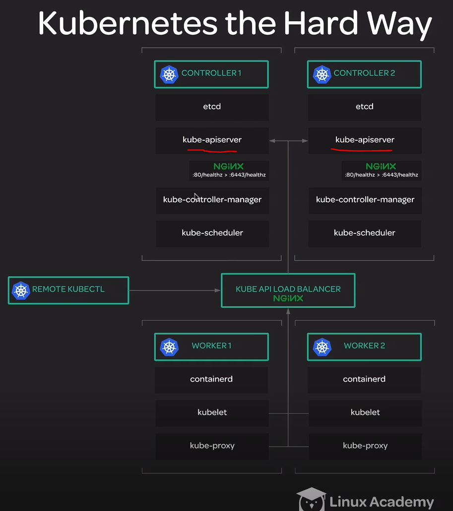

## In this article I will show how to deploy Kubernetes cluster Hard way with ansible codes

#### The network topology will be like as the following (The folowing page shows us 2 contrllers and 2 workers but, in our case they are 3):


#### Clone the repository and go inside of the `KubernetesClusterCreate` folder:
```bash
$ git clone https://progit.tk/devops/ansiblecodes.git && cd ansiblecodes/KubernetesClusterCreate
```

#### Please note before start to deploy everything we must configure our worker,controller and API loadbalancer node A records inside of the internal DNS server. In my case they looks like the following:
```bash
10.234.190.28 kubelb
10.234.190.29 kubecnode1
10.234.190.31 kubecnode2
10.234.190.34 kubecnode3
10.234.190.35 kubewnode1
10.234.190.36 kubewnode2
10.234.190.37 kubewnode3
```

##### First of all we must configure `hosts` file which `ansible-playbook` goes to read to communicate with the nodes. If you don't have an internal DNS server, then you must add needed lines to each of the nodes `/etc/hosts` file. We have 4 group of he servers.

- local - all certificates and config files will be generated in the Desktop which will be copied to the Worker, Controller and Loadbalancer nodes.
- kubecontrollers - All controller nodes.
- kubeworkers - All worker nodes.
- apilbs - API loadbalancer for the worker and controller nodes.

##### Before deploy everything, just edit the `vars/global.yml` file which stores all variables needed to our lb, worker and controller nodes. We can find there all IP addresses and names of the lb,worker and controller nodes.

##### After definition of the variables we can execute `install.sh` script which will prepare all certificate and config files. Then copy and deploy everything to our cluster nodes.

- `prepareCerts.yml` - Prepare all certificates and config files
- `deploy-apilb.yml` - Install and configure API loadbalancer
- `deploy-controllers.yml` - Install and configure all controller nodes
- `deploy-workers.yml` - Install and configure all worker nodes
- `configureAdmin.yml` - Configure Desktop to use Kubernetes cluster

At the end just execute the `install.sh` script:
```bash
$ ./install.sh
```
