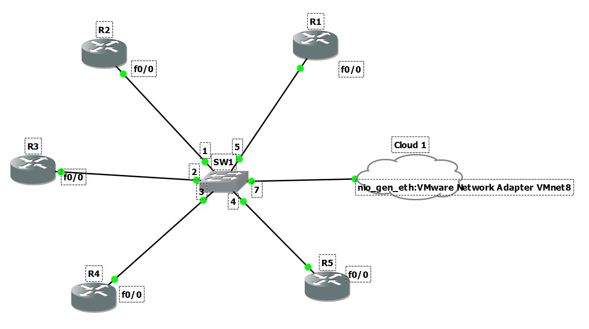
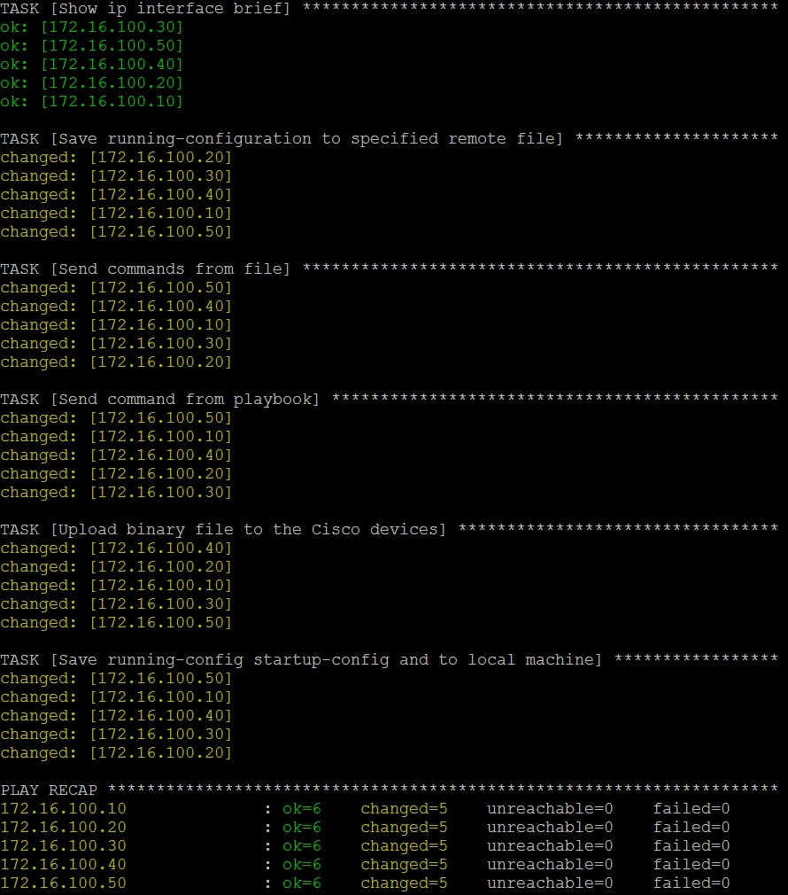

#####In this article I will show how to use ansible playbooks to control Cisco IOS devices. We will test to send commands from file and from playbook, write configs, send file and get file to Cisco routers. For my test environment I used GNS3 with Cisco 3745 Routers. I have configured 5 Routers which is connected to Cloud1 interface. Cloud interface is already connected to VMNet8 virtual network card which is looking to the VMware workstation NAT subnet and my Fedora desktop is works in this subnet. All routers configured before with username "jshahverdiev" and password "freebsd" but, if you want, you can configure all your devices with tacacs+ and domain controller from this [link](https://jamalshahverdiev.wordpress.com/2016/07/14/centos-6-7-tacacs-gns3cisco-3600-domain-controller-integration/).

#####IP address list as following. 
#####Routers: 
```sh
172.16.100.10
172.16.100.20
172.16.100.30
172.16.100.40
172.16.100.50
```

#####Fedora Desktop (Ansible playbooks works here):
```sh
172.16.100.128
```

#####My topology looks like following:


#####To configure Cisco network devices, use the following commands. This commands configure IP address, username with password, secret password, generates SSH keys, activate ssh access and SCP access to the routers (Don't forget change IP address for other routers).
```sh
R1# format flash:
Format operation may take a while. Continue? [confirm]
Format operation will destroy all data in "flash:".  Continue? [confirm]
R1# configure terminal
R1(config)# int fa 0/0 
R1(config)# no shut
R1(config)# ip address 172.16.100.10 255.255.255.0
R1(config)# ip domain name cisco.local
R1(config)# crypto key generate rsa
R1(config)# service password-encryption
R1(config)# username jshahverdiev privilege 15 password freebsd
R1(config)# enable secret freebsd
R1(config)# aaa new-model
R1(config)# aaa authentication login default local
R1(config)# aaa authorization exec default local
R1(config)# ip scp server enable
R1(config)# line vty 0 4
R1(config-line)# transport input ssh
R1(config-line)# logging synchronous
R1(config-line)# exec-timeout 60 0
R1(config-line)# do wr
```

```sh
Note: If you want to use tacacs+ then use the following commands:
      R1(config)# aaa authentication login default group tacacs+
      R1(config)# aaa authorization exec default group tacacs+
```

#####If you want to debug SCP or SSH in your routers use the following commands:
```sh
R1# debug ip scp
R1# debug ip ssh
```

####Let's start to configure Fedora desktop with ansible installed to use playbooks. Copy original file of /etc/ansible/ansible.cfg to backup because we will change this file for new library.
```sh
$ cp /etc/ansible/ansible.cfg ~/
```

#####My current place of playbooks is /home/jshahverdiev/ansible-playbooks/ansible-cisco-playbooks.

#####First of all install python module and clone code files from GitHub repositories. Go downloaded folder and download libraries from GitHub repository.
```sh
$ sudo pip install ntc-ansible
$ git clone https://github.com/jamalshahverdiev/ansible-playbooks-in-practice.git
$ cd ansible-playbooks-in-practice/cisco-playbooks/cisco-daily-using-playbook/ 
$ git clone https://github.com/networktocode/ntc-ansible --recursive
```

#####Edit ansible.cfg file like as following (Don't forget to change to right library and template path in your workplace. Change /home/jshahverdiev/ path to your right place.):
```sh
$ cat /etc/ansible/ansible.cfg | egrep -v '^#|^$'
[defaults]
library = /home/jshahverdiev/ansible-playbooks-in-practice/cisco-playbooks/cisco-daily-using-playbook/ntc-ansible/library/
host_key_checking = False
[privilege_escalation]
[paramiko_connection]
[ssh_connection]
control_path = %(directory)s/ansible-ssh-%%C
[accelerate]
[selinux]
[colors]
```

#####The ntc-ansible/library/ folder contains libraries which we will use in our playbooks.
#####Inventory file of our playbook file must contains the following lines (username, password, secret variables for our routers. Inventory hosts name is ciscors).
```sh
$ cat cisco-hosts
[ciscors:vars]
user=jshahverdiev
pass=freebsd
secret=freebsd

[ciscors]
172.16.100.10
172.16.100.20
172.16.100.30
172.16.100.40
172.16.100.50
```

###I will descibe all tasks in playbook file as following.
#####Execute in all routers command "show ip interface brief" and get back result with JSON format.
```sh
  - name: Show ip interface brief
```
#####Save "running-config" for all routers with "running.cfg" name in routers flash:/
```sh
- name: Save running-configuration to specified remote file
```
#####Send commands from "send_commands.txt" file to all routers. Each command must be placed in one line (Don't use "configure terminal" in file because, script will do this automatically). 
```sh
- name: Send commands from file 
```
#####Send all commands under commands line to all Routers. Each command must be placed in one line (Don't use "configure terminal" in file because, script will do this automatically).
```sh
- name: Send command from playbook
```
#####Upload new firmware to all Cisco Routers. You must change "localfile" variable path for your image.
```sh
- name: Upload binary file to the Cisco devices
```
#####Save "running-config" to "startup-config" in all routers and save local copy with inventory_name in the images folder:
```sh
- name: Save running-config startup-config and to local machine
```
#####At the end execute the following command to do all things in our routers:
```sh
$ sudo ansible-playbook -i cisco-hosts cisco-playbooks.yml
PLAY [Control Cisco devices and get Json formatted data] ***********************
```


